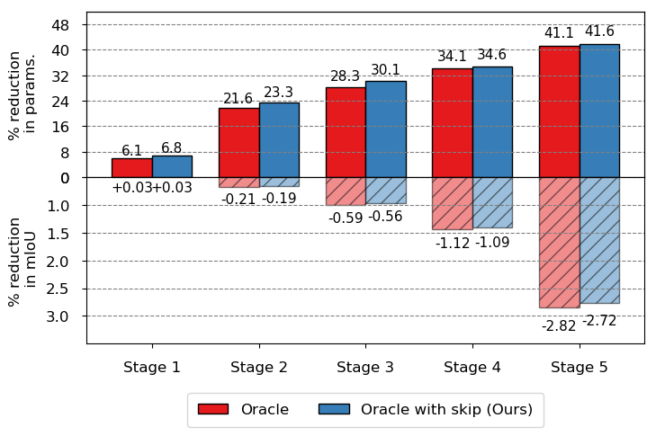

# Network-Compression

Network Compression is the technique of optimising a deep learning model by reducing its number of parameters. In our [paper](https://arxiv.org/pdf/1808.03833.pdf), we do this by computing l2 norm of orcale ranking based on first order Taylor expansion for each layer followed by removal of parameters which are less than a given threshold and retraining the network.   

This repository contains our TensorFlow implementation of Network-Compression for [AdapNet++](https://github.com/DeepSceneSeg/AdapNet-pp), which allows you to compress your own model on any dataset and evaluate results in terms of the mean IoU metric. 

If you find the code useful for your research, please consider citing our paper:
```
@article{valada18SSMA,
  author = {Valada, Abhinav and Mohan, Rohit and Burgard, Wolfram},
  title = {Self-Supervised Model Adaptation for Multimodal Semantic Segmentation},
  journal = {arXiv preprint arXiv:1808.03833},
  month = {August},
  year = {2018},
}
```
## Example Results

| Dataset       | Compression Plot    |
| :--- | ------------- | 
| Cityscapes    |

## Contacts
* [Abhinav Valada](http://www2.informatik.uni-freiburg.de/~valada/)
* [Rohit Mohan](https://github.com/mohan1914)

## System Requirements

#### Programming Language
```
Python 2.7
```

#### Python Packages
```
tensorflow-gpu 1.4.0
```
## Pruning Procedure
    1. Train the AdapNet++ network on a given dataset until convergence.
    2. Compute the Oracle values of the model by running get_oracle_rank.py script.
    3. Prune the model using prun_model.py script. The script allows to prune all the layers of a given section (such as block1, block2, easpp etc.) based on the set threshold at once. 
       Note: Prun one layer at a time for better performance (time-consuming).
              To set the threshold value for a given layer, start from a lower threshold, zero out the parameters less than the threshold (in script set try_zeros = True), save and evaluate the checkpoint. Keep on increasing the threshold until you see about 1% (less aggressive) deviation from the default mIoU.
    4. Re-train the pruned model. 
    5. Repeat steps 2-4 until the desired parameter reduction vs mIoU reduction tradeoff is obtained.

## Params

#### Pruning Param
    * The following parameters can be set at the beginning of the prun_model.py script. The script contains a description of the same.
    * The pruning script generates the pruned model definition and checkpoint. (mask indices .npy file if necessary)  

#### Training Params
```
    gpu_id: id of gpu to be used
    model: name of the model
    num_classes: number of classes (including void, label id:0)
    intialize:  path to pre-trained model
    checkpoint: path to save model
    train_data: path to dataset .tfrecords
    batch_size: training batch size
    skip_step: how many steps to print loss 
    height: height of input image
    width: width of input image
    max_iteration: how many iterations to train
    learning_rate: initial learning rate
    save_step: how many steps to save the model
    power: parameter for poly learning rate
    mask: mask for shortcut connections if any
    model_def: defintion of the model (number of filters for each layer) 
```

#### Evaluation Params
```
    gpu_id: id of gpu to be used
    model: name of the model
    num_classes: number of classes (including void, label id:0)
    checkpoint: path to saved model
    test_data: path to dataset .tfrecords
    batch_size: evaluation batch size
    skip_step: how many steps to print mIoU
    height: height of input image
    width: width of input image
    mask: mask for shortcut connections if any
    model_def: defintion of the model (number of filters for each layer) 
```
#### Rank Params
```
    gpu_id: id of gpu to be used
    model: name of the model
    num_classes: number of classes (including void, label id:0)
    checkpoint: path to saved model
    test_data: path to dataset .tfrecords
    batch_size: evaluation batch size
    skip_step: how many steps to print mIoU
    height: height of input image
    width: width of input image
    rank_save: path to save computed oracle values
    mask: mask for shortcut connections if any
    model_def: defintion of the model (number of filters for each layer) 
```
## Training, Evaluation and Ranking

#### Training Procedure
Edit the config file for training in config folder.
Run:
```
python train.py -c config/train.config or python train.py --config config/train.config
```

#### Evaluation Procedure

Select a checkpoint to test/validate your model in terms of the mean IoU metric.
Edit the config file for evaluation in config folder. Run:
```
python evaluate.py -c config/test.config or python evaluate.py --config/test.config
```

#### Ranking Procedure

Select a checkpoint to compute orcale values of the model.
Edit the oracle_rank config file in config folder. Run:
```
python get_oracle_rank.py -c config/orcale_rank.config or python get_orcale_rank.py --config/orcale_rank.config
```


## Additional Notes:
   * Information regarding network intialization and data preparation is available [here](https://github.com/DeepSceneSeg/AdapNet-pp/blob/master/README.md).
   * Trained model checkpoints for various datasets (such as ForestFreiburg, Cityscapes, Synthia, SUN RGB-D and ScanNet v2) can be found [here](https://github.com/DeepSceneSeg/AdapNet-pp/blob/master/README.md).
